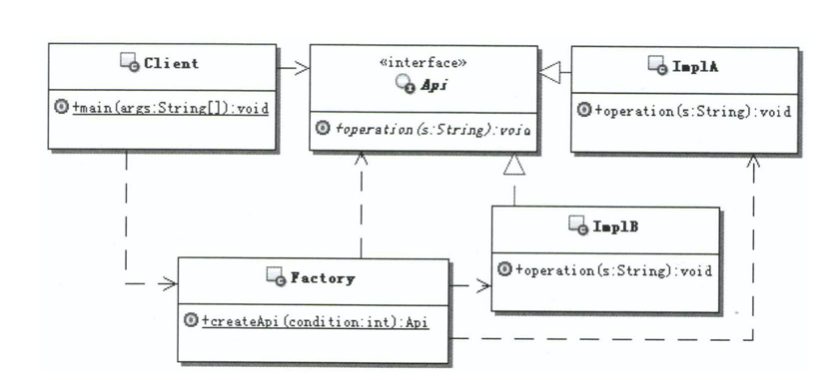
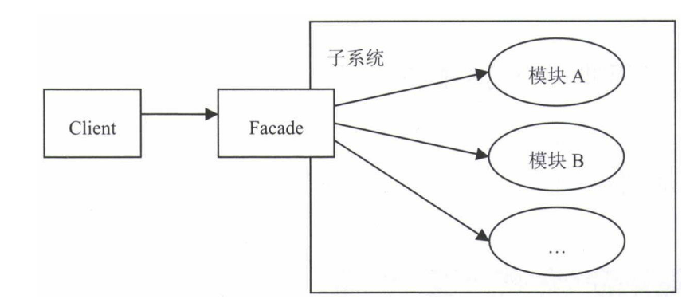
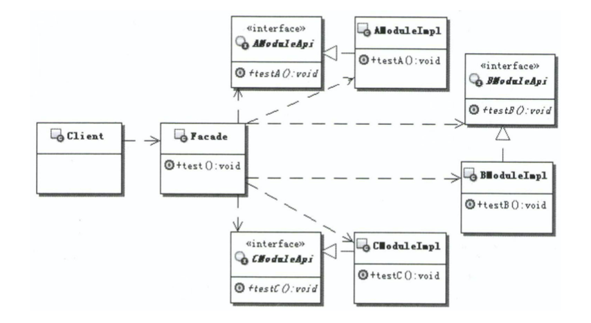
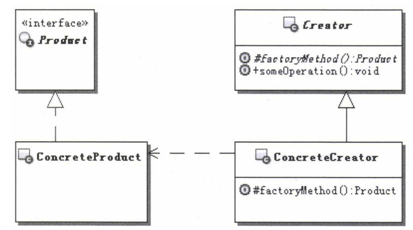
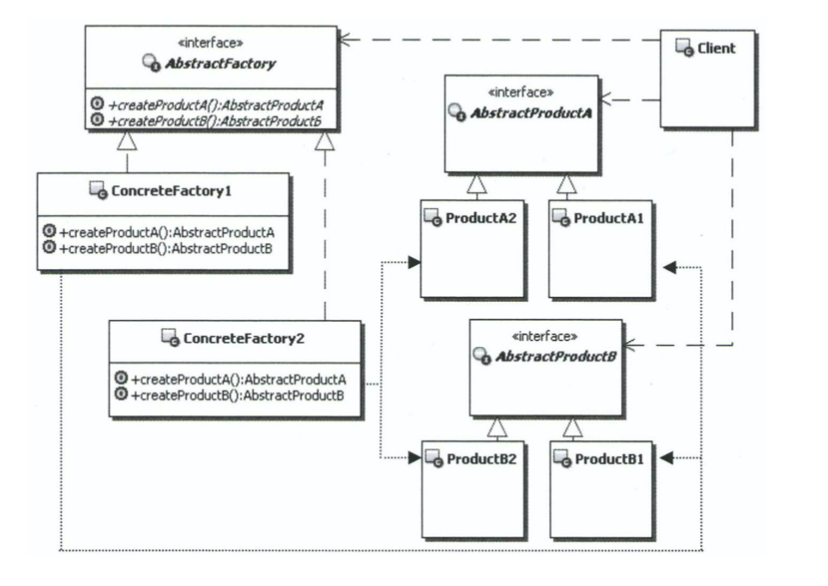

# Swift 设计模式

## 简单工厂模式（SimpleFactory）

## 外观模式（Facade）

外观模式的目的不是给子系统添加新的功能接口，而是为了让外部 减少与子系统内多个模块的交互，松散耦合，从而让外部能够更简单地 使用子系统。

## 适配器模式（Adapter）

## 单例模式（Singleton）

## 工厂方法（Factory Method）

## 抽象工厂模式（Abstract Factory）

## 参考资料

* [研磨设计模式]()